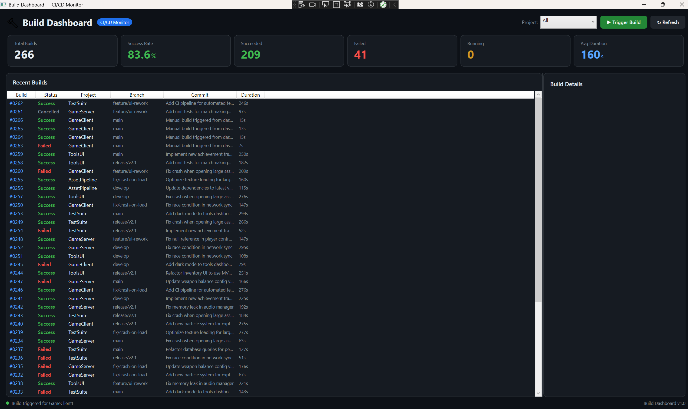
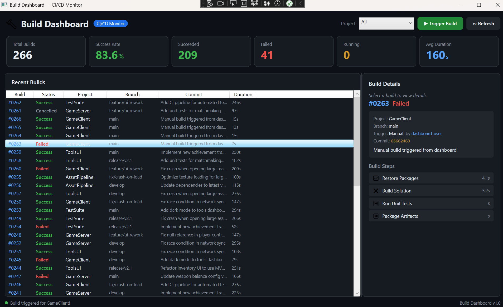
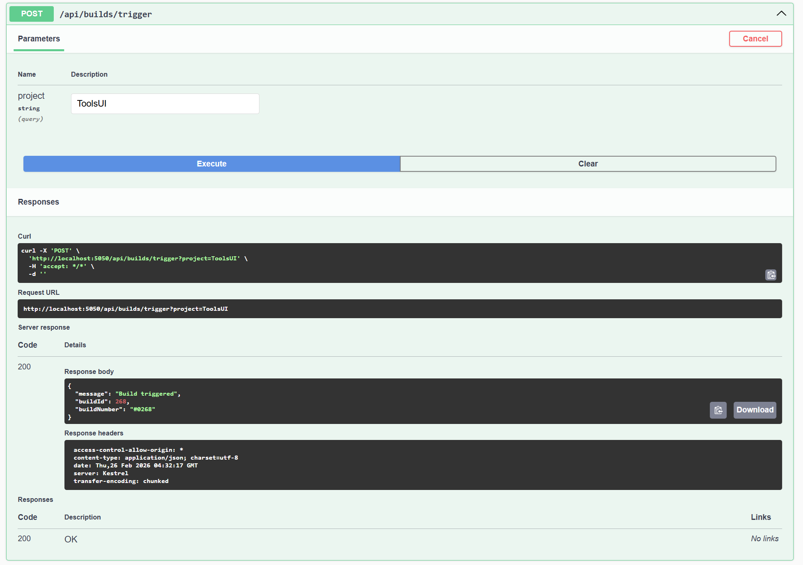

# BUILD DASHBOARD - CI/CD MONITOR

Built a CI/CD build monitoring dashboard with a WPF frontend and ASP.NET Core backend that tracks build status, history, step by step progress and performance metrics across multiple game development projects.



## PROJECT OVERVIEW

many game studios run hundreds of builds daily across multiple projects that includes game clients, servers, tools, test suites. Tools team build internal dashboards to monitor these pipelines to spot failures quickly and track build health over time.

This project replicates such system and implements a full stack build monitoring system:
- **Backend API** that stores build history, simulates build execution and exposes query endpoints
- **WPF Dashboard** that displays real time metrics, build lists and step by step details
- **Sample data generator** that creates 60 days of realistic build history across 5 game projects

## FEATURES

### WPF Dashboard
- **Real time metric cards** - total builds, success rate, failures, running, and average duration
- **Build history list** with color-coded status (green/red/yellow) and project filtering
- **Build detail panel** showing commit info, branch, trigger type and step by step progress with right (green ticks) and wrong (red cross) icons
- **Trigger Build button** - starts a new simulated build that progresses through steps in real time
- **Auto-refresh** every 5 seconds with connection status indicator
- **Dark theme** inspired by GitHub's CI/CD interface

### REST API
- **Paginated build listing** with filtering by project and status
- **Build detail endpoint** with full step information
- **Dashboard summary** with success rates, trends and project breakdown
- **Trigger build endpoint** that simulates async build execution with step by step progression
- **Swagger documentation** for interactive API testing

### Build Simulation
- Realistic 60 day history with 2-8 builds per day across 5 projects
- 75% success / 18% failure / 7% cancelled distribution
- 6 build steps per job with cascading failure behavior (failed step -> remaining steps skipped)
- Realistic commit messages, branches, and trigger types



# ARCHITECTURE

```
--------------------------------
│     WPF Dashboard (App)      │
│  - MVVM Pattern              │
│  - Auto refresh timer        │
│  - Data binding to API data  │
--------------------------------
               | HTTP (localhost:5050)
--------------------------------
│    ASP.NET Core API          │
│  - Minimal API endpoints     │
│  - Build simulation engine   │
│  - Swagger documentation     │
--------------------------------
               | Entity Framework Core
--------------------------------
│       SQLite Database        │
│  - BuildJobs table           │
│  - BuildSteps table          │
--------------------------------
--------------------------------
│    Shared Core Library       │
│  - Models (BuildJob, etc.)   │
│  - DbContext + seed data     │
--------------------------------
```

## TOOLS AND TECHNOLOGIES

- **C#/ .NET 8.0** - application framework
- **WPF / XAML** - desktop UI with MVVM pattern
- **ASP.NET Core Minimal APIs** - REST backend
- **Entity Framework Core + SQLite** - data persistence
- **Swagger / OpenAPI** - API documentation
- **Newtonsoft.Json** - HTTP response deserialization
- **Multi-project solution** - App, Api and Core library

## PROJECT STRUCTURE

```
build-dashboard/
├── BuildDashboard.Core/           # Shared library
│   ├── Models/
│   │   └── BuildJob.cs            # BuildJob, BuildStep, DashboardSummary
│   └── Data/
│       └── BuildDbContext.cs       # EF Core context + 60 day seed data
├── BuildDashboard.Api/            # REST API
│   └── Program.cs                 # Endpoints + build simulation engine
├── BuildDashboard.App/            # WPF Dashboard
│   ├── ViewModels/
│   │   └── DashboardViewModel.cs  # Dashboard logic + auto-refresh
│   ├── Commands/
│   │   └── RelayCommand.cs        # MVVM command implementation
│   ├── Services/
│   │   └── ApiClient.cs           # HTTP client for API communication
│   ├── MainWindow.xaml             # Dashboard UI layout
│   └── MainWindow.xaml.cs          # Minimal code-behind
└── images/                        # Screenshots
```

## GETTING STARTED

### Prerequisites
- Windows 10/11
- .NET 8.0 SDK
- Visual Studio 2022

### Build & Run
```bash
git clone https://github.com/rush2pranav/build-dashboard.git
# Open BuildDashboard.sln in Visual Studio
```

1. Set **BuildDashboard.Api** as startup project -> Press F5
2. Verify API at `http://localhost:5050/swagger`
3. Keep API running -> Right-click **BuildDashboard.App** -> Debug -> Start New Instance
4. The dashboard will connect and display build data automatically



## API ENDPOINTS

| Method | Endpoint | Description |
|--------|----------|-------------|
| GET | `/api/builds` | List builds (filter by project, status) |
| GET | `/api/builds/{id}` | Build details with steps |
| POST | `/api/builds/trigger` | Trigger a new simulated build |
| GET | `/api/dashboard/summary` | Metrics, trends, and project stats |
| GET | `/api/dashboard/projects` | Per-project statistics |

## WHAT I LEARNED

- **Full-stack .NET is cohesive** - Using C# for both the WPF frontend and ASP.NET backend, with a shared Core library, creates a seamless development experience. The same models are used everywhere with zero translation layer.
- **Simulating real systems teaches you how they work** - Building the build simulation engine with queued/running/success/failed states, step cascading, and async execution gave me a deep understanding of how real CI/CD systems like GitHub Actions and Jenkins operate under the hood.
- **Auto refresh in WPF requires threading awareness** - Using DispatcherTimer ensures UI updates happen on the correct thread, while the HTTP calls happen asynchronously without blocking the interface.
- **MVVM pays off in dashboards** - With multiple metric cards, a list, and a detail panel all binding to the same ViewModel, changes to the data automatically propagate everywhere. No manual UI update code needed.

## POTENTIAL EXTENSIONS

- Add real GitHub Actions webhook integration to monitor actual CI pipelines
- Implement SignalR for real-time push updates instead of polling
- Add build duration trend charts using LiveCharts or OxyPlot
- Build notification system (toast notifications on build failure)
- Add build comparison view (differentiate two builds side by side)
- Implement build log viewer with syntax-highlighted output
- Add user authentication and role based access

## LICENCE

This project is licenced under the MIT Licence - see the [LICENCE](LICENSE) file for details.

---

*Built as part of a Game Tools Programmer portfolio. Demonstrates WPF/MVVM, ASP.NET Core APIs, Entity Framework, and CI/CD concepts relevant to game studio tools teams. I am open to any and every feedback, please feel free to open an issue or connect with me on [LinkedIn](https://www.linkedin.com/in/phulpagarpranav/).*
